# Mockifer - a cross platform embeddable mocking server for iOS, Android and MacOs

--


- [Introduction](#introduction)
- [Getting started guide](#quick_start_guide)
- [Dynamic routing system](#routing_system)
- [Working with Mockifer](#working_with_mockifer)
- [Magic Tokens](#magic_tokens)
- [Core engine walkthrough](#core_engine)
- [Mockifer API](#mockifer_api)
- [Licence](#licence)

<a name="introduction"></a>
--
# Introduction

**Mockifer** is a framework for building a portable http web server that can be embedded into mobile and other targets and used internally as a server endpoint - making it perfect for *demo* versions of an app or for automation tests with it taking the role of a *mock server*.

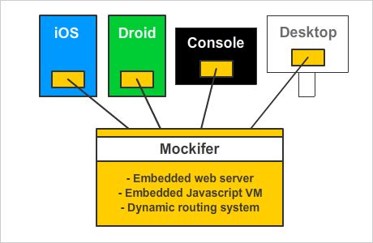

Some of the key goals for the creation of **Mockifer** were:

1. It must be able to be embedded directly inside iOS, Android or whatever other platforms desired.
2. When deployed, it must be self contained and require no external library dependencies to run.
3. It must be portable and be able to compile to target iOS, Android, MacOS (console and desktop) and potentially other target platforms.
4. It must be easy to setup and configure mock request responses.
5. It must be easy to setup and configure rich request responses.
6. It must be authored to be compatible with an *MIT licence* in its code and libraries that it uses so everyone can safely use and share it.

### Why bother? - there are already other embeddable server options!

There are many ways to create local web servers or mocking servers that run on the desktop or for specific platforms architectures, however there don't seem to be very many solutions that are truly embeddable and portable that can be **embedded** across **different platforms** produced from the **same code base**.

The goal of this framework is to produce a cross platform library - primarily for iOS and Android (though compatible with other targets also), that behaves like a development or mock server, but that can be **packaged internally and completely self contained** inside a host application - write **once** and compile to **many**.

### Who is this for?

Mockifer was created as a way to having one single common mocking platform that both developers and automation testers use the same shared instance of for all pipelines of mobile development work.

It **specifically** aims at **native** mobile development for Android and iOS - **native** meaning that for iOS you are using Xcode with ObjectiveC or Swift and for Android you are using Android Studio with Java or Kotlin.

If you develop mobile applications with other middleware tooling such as Xamarin, ReactJS, Cordova etc, then this library is likely not for you and you may already have some other cross platform techniques available to you that could achieve a similar goal.

### How does it work?

At a glance, Mockifer is comprised of:


**C/C++ Core Engine**

- The *C/C++ core engine* runs a portable web server alongside an embedded *Javascript virtual machine* and handles incoming HTTP requests using a routing system driven by dynamic rules.

- The *C/C++ core engine* is **decoupled** from the embedded *Javascript application* so they can have different software development lifecycles. The likely scenario is that the *C/C++ core engine* would rarely - if ever - change, whereas the embedded *Javascript application* and *routing configurations* would change regularly as more routes and responses are configured. Because they are separate components, they can be deployed separately from each other.

- By decoupling the *C/C++ core engine* from the *Javascript application* and *route configurations*, there is no need to write any code in C/C++ to use Mockifer (unless new functionality is needed inside the core engine). This was a deliberate decision - having a Javascript and content based server implementation makes Mockifer far more accessible to developers and / or automation testers than C/C++ is.

- The HTTP web server in the core engine is provided by the open source library [CivitWeb - https://github.com/civetweb/civetweb]("https://github.com/civetweb/civetweb").

- All JSON parsing in the core engine is performed by the open source library [JsonCpp - https://github.com/open-source-parsers/jsoncpp]("https://github.com/open-source-parsers/jsoncpp")

- The embedded Javascript Virtual Machine in the core engine is provided by the open source library [Duktape - https://github.com/svaarala/duktape]("https://github.com/svaarala/duktape")

**Routing rules - dynamic routing system**

- The core engine runs a **dynamic routing rule system** for all incoming requests which forms the heart of handling all requests.

- A collection of *registered routes* is evaluated for each request, and based on their rules, the *C/C++ core engine* will forward a selected route (if it matches one) to the embedded *Javascript application* to process and respond to.

- Registered routes can be configured to always be evaluated for each request, or only evaluated if they are **activated** first. This allows a flexible system where a set of routes is used as a constant foundation, but **mock** routes can be activated when needed to override responses.

**Javascript bridge and content**

- The bridge between the *C/C++ core engine* and the embedded *Javascript virtual machine* is made via a small set of methods that each side must contractually meet.
- Alongside the actual Javascript source files sits all other content such as the collection of **routes**, **mock responses** and other assets.

**Javascript Virtual Machine**

- The Javascript Virtual Machine (powered by *Duktape*) hosts the dynamic server application itself, which the core engine delegates requests to fetch the appropriate *response*.

- The Javascript application running in the virtual machine must take a *request* and *route* and return a *response* to the core engine, which is then forwarded back to the original caller as a HTTP response.

- The Javascript Virtual Machine is capable of running any *Ecmascript E5/E5.1* compliant Javascript code (as supported by *Duktape*).

- **Mockifer** uses [Kotlin JS - https://kotlinlang.org/docs/reference/js-overview.html]("https://kotlinlang.org/docs/reference/js-overview.html") to author the dynamic server application. By using *Kotlin JS*, the server Javascript development can be done using *Android Studio* or *IntelliJ* with all the benefits of an *IntelliJ* IDE and the awesome-sauce that is *Kotlin*.

- Although the **Mockifer** framework uses *Kotlin JS*, it is completely possible to use other Javascript code instead, but I **hate** writing Javascript so I chose to go with *Kotlin JS*! It is totally possible though to not use *Kotlin JS* at all, and instead write all your Javascript code in plain Javascript or TypeScript or something - as long as it is compatible with the *Duktape Javascript Virtual Machine*.

<a name="quick_start_guide"></a>
--
# Getting started guide


Mockifer was written with mobile applications in mind - therefore it requires a few key mobile development tools to be available in order to compile and edit.

By nature this pretty much means that you'll need to be working on a Mac. Mockifer could probably be adjusted to compile on Windows machines too but it's not something I'm interested in pursuing - feel free to fork this repo if you are so inclined!

**Important!**

Before starting, you will need to have installed [Java JDK 8](http://www.oracle.com/technetwork/java/javase/downloads/jdk8-downloads-2133151.html) if you haven't already. **Do not install JDK 9**. After installing the JDK, you can check that everything is ok by running the following command in a *Terminal* session:

```
java -version
```

If you see output similar to this then you are good to go:

```
java version "1.8.0_91"
Java(TM) SE Runtime Environment (build 1.8.0_91-b14)
Java HotSpot(TM) 64-Bit Server VM (build 25.91-b14, mixed mode)
```

### Step 1: Install prerequisite tools

**iOS Framework, Mockifer Editor, Console application**

If you want to be able to compile the *Mockifer Editor*, the *iOS Framework* or the *Mockifer Console Application* you will need to install Xcode along with developer provisioning. Also you will need to install Xcode command line build tools which can be installed via:

```
xcode-select --install
```

**Android AAR Library**

If you want to be able to compile the *Android AAR Library* you will need to install Android Studio and the accompanying Android SDKs, along with the Android NDK and CMake which can be installed in the Android SDK Manager via Android Studio: [https://developer.android.com/ndk/guides/index.html](https://developer.android.com/ndk/guides/index.html)

**Edit KotlinJS content**

If you want to be able to edit the Kotlin code that generates the Mockifer content, you can either use Android Studio, or if you prefer not to install the Android tooling, you can use [IntelliJ Community Edition](https://www.jetbrains.com/idea/download/#section=mac) instead.

### Step 2: Explore the project structure

The Mockifer folder structure is broken into three main sections; **content**, **products** and **support**.

The **content** folder contains the *KotlinJS* project that is compiled any time the routes and data that forms the content needs to be changed. It contains both the static route JSON data files and the Kotlin code that drives more intelligent mock responses.

The **products** folders contain mostly generated outputs from compiling the projects in the **support/source** and **content** folders. You should almost never edit content in a **product** folder, as it will be regenerated next time a build task is run.

The **products** folders are however the place where you would take a compiled library or framework, or the latest compiled content to integrate into your own applications.

```
Mockifer root directory
|
+ - content:            Kotlin project that compiles into the Mockifer content.
+ - build.sh:           Shell script to build the content project.
+ ─ mockifer:           Compiled standalone console application.
+ ─ MockiferEditor.app: Compiled MacOS app for editing Mockifer content.
 
+ ─ products
    |
    + - content
      + - android:      Compiled content for an Android app.
      + - editor:       Compiled content for Mockifer Editor or Console app.
      + - ios:          Compiled content for an iOS app.
    + - libs
      + - android:      Compiled Android AAR library.
      + - ios:          Compiled iOS framework.
 
+ - support:            Source code for the products except the content. Also sample apps for iOS and Android.


```

### Step 3: Test drive the editor

To see Mockifer in action - open the *MockiferEditor.app* file in the root of the project.

Upon launching, the editor will try to build the content from the *content* project and use the compiled output in the *products/content/editor* directory as a source for its data.

> Note: The first time you run the editor you might need to right click and choose *Open* and agree to run it. Also the first time the content builds it may take a while to download the Gradle dependencies required.

When the editor has finished building the content and is launched, you will see something similar to this:

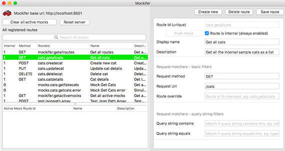

> Note: The only time you would need to recompile the editor is if you want to change its behaviour. If so, you can find the source code for the editor in *support/source/editor*. It is a native MacOS application so you need to open it in Xcode. There is also a *build.sh* script in that folder that can be run to compile the editor.

Explore the **registered routes** to see how the configuration system works.

The editor is actually running Mockifer itself, so you can open your local web browser and point it to one of the routes to see it working! [http://localhost:8501/cats](http://localhost:8501/cats)

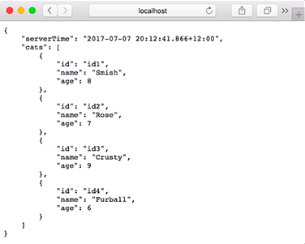

### Step 5: Test drive the sample apps

Explore how the Mockifer engine and content is integrated into the sample apps to get an understanding of how you can use it.

To try the sample applications:

**Android**

For Android: Start Android Studio then open the Android project in the *support/samples/sample-android* directory.

The Android app includes two product flavours **normal** and **mock**.

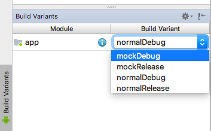

The **normal** flavour does not embed Mockifer at all or really know anything about it, and the Espresso automation tests should be run against the **normal** flavour. You will need to have the *Mockifer Editor* running when running the **normal** flavour. See the *build.gradle* file for the app to find out how it works. 

The **mock** flavour has an embedded instance of Mockifer running which the app points to, making it a self contained app/server artifact.

The **Espresso automation** tests also has an embedded instance of Mockifer running, which the **normal** app can be configured to point to. This allows for automation tests to be run against the real app as a standalone solution - even on real devices.

Examine the configuration of the *implementation* dependencies and source sets to see how Mockifer is only embedded into the **mock** and **Espresso automation** products.

**iOS**

For iOS: Start Xcode then open the iOS project in the *support/samples/sample-ios* directory.

The iOS app includes two product targets **normal** and **mock**.

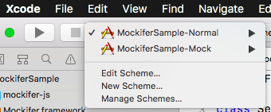

Similar to the Android app, the **normal** target does **not** embed Mockifer or really know about it, whereas the **mock** target packages an embedded instance of Mockifer inside it so is a self contained app/server artifact. You will need to have the *Mockifer Editor* running when running the **normal** target. See the build configurations for the two targets to find out how it works.

The **XCTest automation suite** also has an embedded instance of Mockifer running, which the **normal** app can be configured to point to. Similar to Android, this allows for automation tests to be run against the real app as a standalone solution - even on real devices.

Examine the build configurations to see how Mockifer is only embedded into the **mock** and **XCTest automation** targets.

<a name="routing_system"></a>
--
# Dynamic routing system

> Important: This video tutorial was recorded on an older version of Mockifer that had a different directory structure but the video content about how routes work is still valid.

Video tutorial: [https://www.youtube.com/watch?v=jNC88N8UhyY](https://www.youtube.com/watch?v=jNC88N8UhyY)

[](https://www.youtube.com/watch?v=jNC88N8UhyY)

The heart of **Mockifer** is the *dynamic routing system*, which uses a small set of rules to figure out which *route* should be selected when a request is received.

Routes fall into roughly two categories:

1. **Internal routes** - these routes are always *on* and will always be evaluated for each incoming request.
2. **Mock routes** - these routes are always *off* and will **only** be evaluated for each incoming request if they are first **pushed**.

The idea is that the *internal* routes are what form the *foundation* of the server implementation and require no setup to be activated, whereas the *mock* routes must be activated to simulate conditions or scenarios - usually for automation testing where a repeatable state must be in place for each test run.

> Note: The ```manifest.json``` file has a section labelled ```binary_response_file_types``` which specifies a list of file type suffixes that when found at the end of an incoming URI, should automatically route to become a file download - skipping the routing system.<br/><br/>For example: ```http:// .. /data/images/kitty1.png``` would result in the *kitty1.png* file being downloaded and returned. Add any other file type suffixes to the ```manifest.json``` to include other downloadable files.<br/><br/>The default manifest has some common file types that would typically result in a file download.

Here is a table of the route fields that can be edited using the editor application:

| Field        | Sample           | Description |
| ------------- |-------------| -----|
| Route Id      | cats.getallcats | An identifier that is **unique across all routes** known to Mockifer. |
| Internal Flag      | On / Off | If set to *on*, the route will form part of the foundation set of routes. If set to *off*, the route will only be evaluated if it is first *pushed*. |
| Display Name | Get all cats | A simple short display name for the route. |
| Description | Get all the cats in the known universe! | A longer description that gives an overview of the purpose and intent of the route |
| Request Method | GET | The HTTP request method that a request must have to be considered a match for the route. |
| Request Uri | /cats | A regular expression that will be applied to determine if the Uri of a request should be considered a match. For example a sample Uri of */cats/([^/]+)* would match */cats/id1* but would not match */cats*. |
| Route Override | some.other.route.id | The *route override* field is special in that it will simply *hijack* another route if the other route is found to be a match for the request. For example, if there was a route with Id *cats.getallcats* that matched a request, by creating a secondary route with *route override* set to *cats.getallcats*, it would cause the secondary route to run instead. This can be particularly useful for allowing *mock routes* to intercept and override default routes.|
| Query String Contains | bob | If this filter is specified, the raw query string of a request will be checked to see if it **contains** the given token. For example, if the token was *bob* then a request with the query string *cat-name=bobcat&age=10* would match.|
| Query String Equals | cat-name=bobcat | If this filter is specified, the raw query string of a request will be checked to see if it **equals** the given token. For example, if the token was *cat-name=bobcat* then a request with the query string *cat-name=bobcat* would match, but a query string of *cat-name=bobcat&age=10* would not.|
| Request Body JSON Path | /person/name<br>/people/1/name | By specifying a *JSON Path*, the route will attempt to **crawl** the request body if it is a valid JSON object to reach the node given in the path.<br><br>The value of the node if it is found is compared against the *JSON Path Contains* and *JSON Path Equals*.<br><br>To **crawl** the JSON path, it is first split into tokens, delimited by the / character. While *crawling* along the list of tokens, if an integer is encountered it will be interpreted as an index into a JSON array at the current node. The goal of the crawler is to reach the JSON node representing the final token in the path successfully. The value of the element in that node can then be evaluated to complete the filter.|
| JSON Path Contains | bob | When coupled with the *JSON Path* filter, the value that is found by *crawling* the path successfully will be a match if it **contains** the token. For example, if the value in the JSON path */cat/name* was *bobcat* and the token was *bob* then the filter would match.|
| JSON Path Equals | bobcat | When coupled with the *JSON Path* filter, the value that is found by *crawling* the path successfully will be a match if it **equals** the token. For example, if the value in the JSON path */cat/name* was *bobcat* and the token was *bobcat* then filter would match, but if the token was *bob* the filter would not match.|
| Http Status Code | 200 | If defined, the route will return the given status code if an internal implementation doesn't override it. This field is particularly useful to simulate server errors (eg. return a 500 error) that are usually difficult if not impossible to simulate in a real server.|
| Response Delay (ms) | 500 | If defined, the route will simulate a response delay with the given period of time. By default, routes do not simulate any delay and respond as fast as they are able. There is also a global response delay setting - see the API notes for more info.|
| Controller Id | cats.getallcats | If defined, the route will invoke the Javascript application to handle the request, using the *controller id* as a key for mapping to an internal request controller. The embedded Javascript application is responsible for mapping a controller internally with the given controller id.|
| Respond With JSON | { "name": "bob" } | If defined, forms a static *canned* response that will be delivered if the route is matched. Note that the response is saved into a JSON file with the same name as the route id in the */data/mocks* folder.|

### 'Pushing' mocks

One of the key features of Mockifer is the ability to create a set of dynamic routes that only become active if they are **pushed**. 

This allows mock routes or sequences of mock routes to be **pushed** into a queue that will be evaluated as requests come in.

As each *pushed/activated* mock route is matched to an incoming request, it is **consumed** and removed.

<a name="working_with_mockifer"></a>
--
# Working with Mockifer

### The editor

The *Mockifer Editor* (launched by starting the *MockiferEditor.app* file in the root directory) is the preferred way to manage Mockifer routes and their configurations. When using the editor, all changes are automatically *synced* into the content project.

This means that after editing route definitions via the editor, any build job that is run afterward should already have up to date content data files.

Normally all content editing should be done in the editor, and only if custom Kotlin driven mocking behaviour is required would you leave the editor.


### Opening the Kotlin/Javascript application for editing

Follow these steps to be able to edit the Javascript application code (written in *Kotlin JS*):

**Step 1:** Open *IntelliJ* or *Android Studio*, if using *IntelliJ* for the very first time, you will need to setup the default location for the *JDK*. Select *Configure -> Project Defaults -> Project Structure* to open the configuration window.

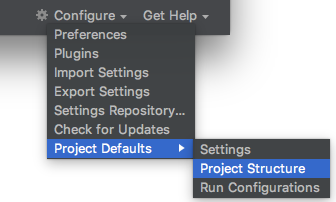

You will need to select the *New* button, then navigate to your installation of the *JDK*. On a Mac this is often at a folder such as:

```
/Library/Java/JavaVirtualMachines/jdk1.8.0_151.jdk
```

After selecting where your *JDK* installation is found the configuration screen should like something like this:

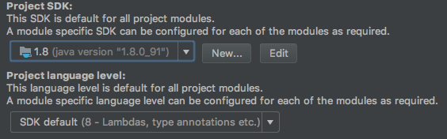


**Step 2:** Choose *Import project (Eclipse ADT, Gradle, etc.)*

**Step 3:** Navigate and select the *content* folder in the files dialog to open.

**Step 4:** Press *OK*

After the project opens and performs a Gradle sync, you should see a screen similar to this:

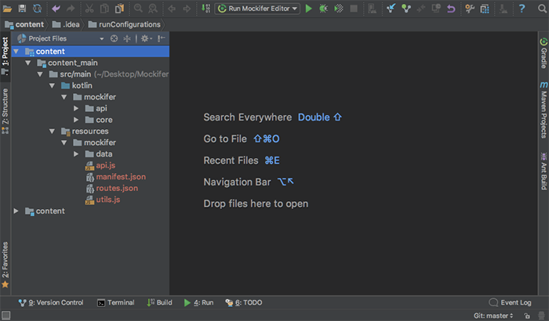

If you can't see the tool bar, select *View -> Toolbar* to make it appear.

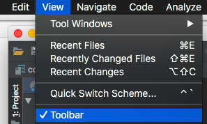

> Note: IntelliJ has a nasty habit of completely deleting the contents of the hidden **.idea** folder when a new project is *imported*. This means any saved *run configurations* get deleted. After importing the Mockifer project for the first time, execute the following command from Terminal while in the *content* directory to restore the run configurations:<br><br> ```./install_run_configurations.sh``` <br><br>After installing the run configurations, a drop down list of run profiles will appear in IntelliJ. This should only need to be done *once* after a fresh import of the Mockifer project.

The project contains all the *Kotlin JS* code that runs inside the Javascript virtual machine and is responsible for responding to requests.

The *resources* in the project contains the configuration content that drives the routing system and integration with the *core engine*. In particular:

```
resources/mockifer
|
+ ─ data
|   + ─ internal:     any files or content that isn't dynamically generated and is typically privately referenced by Kotlin code
|   + ─ mocks:        auto generated mock response files - use the editor to maintain these
|
+ ─ api.js:           Javascript file that forms the bridging contract to the core engine - do not change this
+ ─ manifest.json:    manifest of which Javascript source files should bootstrap when starting Mockifer
+ ─ routes.json:      auto generated collection of registered routes - use the editor to maintain these
+ - utils.js:         collect of helper utilities to fill some of the missing KotlinJS functionality. Some of these might become redundant as future versions of KotlinJS are released.

```

### Run profiles

The **Mockifer** Gradle project has some useful preconfigured run profiles. Access them while in IntelliJ:

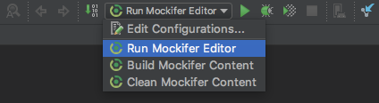

When editing the *Kotlin JS* code you would normally trigger the **Run Mockifer Editor**  profile to build the Kotlin Javascript application and boot it up with the editor application.

> Important: The following video was recorded on an earlier version of Mockifer that required the use of Android Studio to edit the Kotlin code. The content of this video is still valid - just follow the previous instructions on how to open the *content* project in IntelliJ (or Android Studio if you prefer) and interpolate some of the video instructions to account for the current Mockifer structure (its largely the same, just a few things moved around from the previous version).

Video tutorial: [https://www.youtube.com/watch?v=uik2h3ANGo0](https://www.youtube.com/watch?v=uik2h3ANGo0)

[](https://www.youtube.com/watch?v=uik2h3ANGo0)


### Console application

Mockifer can also run as a standalone console application via terminal as well. There is a compiled version already in this repository named **mockifer** in the root directory. To run it, just open a Terminal session in the root directory and enter:

```
./mockifer
```

If you want to build the console application yourself, navigate into the   *support/source/console* directory in a Terminal session, then run the shell script:

```
./build.sh
```

> Note: You may have to open the console's Xcode project at least once to setup your developer signing.


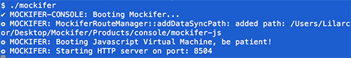

### Postman

Once the console application is running, Mockifer can be reached through a web browser, or any other means of making HTTP requests.

A great tool for interacting with HTTP APIs is [Postman](https://www.getpostman.com/) which can be installed as a Chrome app or as a standalone desktop application.

If you have *Postman* installed, import the file ```support/samples/postman/Mockifer.postman_collection.json``` to try out all the Mockifer sample routes.

> Note that the Mockifer Postman samples point at port **8501** by default, which is what the *Mockifer Editor* runs on. Tweak the port number to **8504** in *Postman* if you want to connect to the console application.

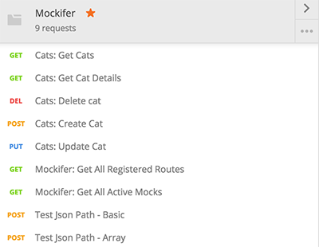

<a name="magic_tokens"></a>
--
# Magic Tokens

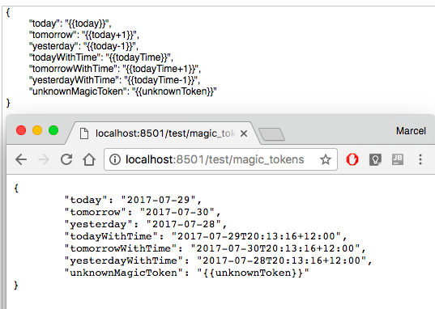

Mockifer has basic support for finding and replacing special tokens within responses with dynamically generated substitutions. For want of a better name, they are called *magic tokens* in Mockifer.

*Magic tokens* are very handy for augmenting otherwise static JSON response files to allow them to include dynamic content. For example, a static JSON response file might include a *date* field that ideally should represent the date at which time it was served to the client, rather than the date the file was originally authored. By setting the value of the *date* field to a *magic token*, it can be dynamically replaced at run time with today's date.

A *magic token* is a string within a JSON response file that starts with two opening braces ```{{``` and ends with two closing braces ```}}```. An example *magic token* could look like: ```{{content}}```

If a *magic token* is detected when parsing a JSON response, handler code inside the Javascript application is run to process the ```content``` element. If the element should be substituted with something else, it will be replaced.

The default implementation of the *magic token* substitution code is in the ```MagicTokenResolver.kt``` file in the Javascript application project. Feel free to add more substitution implementations as needed.

The following default *magic token* implementations are included in this repository:

| Token | Result |
| ----- | ------ |
|```{{today}}```| Will be substituted for the current date formatted as a short date. |
|```{{today+n}}```| Where **n** is an integer, will be substituted for the current date *plus* **n** days. For example, ```{{today+1}}``` would show the formatted date for tomorrow.|
|```{{today-n}}```| Where **n** is an integer, will be substituted for the current date *minus* **n** days. For example, ```{{today-1}}``` would show the formatted date for yesterday.|
|```{{todayTime}}```| Will be substituted for the current date formatted as a long date including time and time zone. |
|```{{todayTime+n}}```| Where **n** is an integer, will be substituted for the current date *plus* **n** days. For example, ```{{todayTime+1}}``` would show the formatted date and time for tomorrow.|
|```{{todayTime-n}}```| Where **n** is an integer, will be substituted for the current date *minus* **n** days. For example, ```{{todayTime-1}}``` would show the formatted date and time for yesterday.|

<a name="mockifer_api"></a>
--
# Core engine walkthrough

> Important: The following video was recorded against an older version of Mockifer but the content is still valid. There have been a few additions and enhancements since this was recorded that are not reflected in the video.

Watch the video below to learn about the core engine and how it works.

Video tutorial: [https://www.youtube.com/watch?v=n9aJkoGPLIw](https://www.youtube.com/watch?v=n9aJkoGPLIw)

[](https://www.youtube.com/watch?v=n9aJkoGPLIw)

<a name="mockifer_api"></a>
--
# Mockifer API

Both iOS and Android share the same basic set of APIs, with some small language adjustments between the platforms.

### Android

To use Mockifer, the AAR library needs to be compiled into an Android application, and a copy of the compiled content from the *products/content/android* directory needs to be placed in the *assets* of the Android application.

After that, Mockifer can be initialised with the *install* methods during application bootstrapping.

| Method        | Description |
| ------------- |-----|
| ```Mockifer.installOnPort(application, assetsContext, port)``` | Call this within your *onCreate* method of your *Application* class or in an automation suite to initialize Mockifer. |
| ```Mockifer.installOnDynamicPort(application, assetsContext)``` | Call this within your *onCreate* method of your *Application* class or in an automation suite to initialize Mockifer and choose a random port to listen on. |
| ```Mockifer.setCommandUrl(baseUrl, port)``` | If you want to redirect Mockifer commands to an instance of Mockifer not embedded in the app, you can tell it where to send them. |
| ```Mockifer.reset()``` | Call this method at any time to revert all internal state, including removal of any pending *active mock routes*. Typically used between automation tests to begin at the default state again.|
| ```Mockifer.setGlobalResponseDelay(millis)```| Call this to configure the *global* response delay in milliseconds applied to simulate response lag. Calling ```Mockifer.reset()``` will clear this setting.|
| ```Mockifer.clearActiveMocks()``` | Call this to remove any pending *active mock routes* that might still be queued to be evaluated for incoming requests.|
| ```Mockifer.pushMock(routeid)``` | Enqueue the route with the given route id **once** to the list of *active* mock routes to evaluate.|
| ```Mockifer.pushMock(routeid, times)```| Same as ```pushMock``` but the route will be added ```times``` number of times into the active mocks list.|
| ```Mockifer.pushMock(... routeids)```| Enqueue a list of route ids, **once** each, into the active mocks list.|


### iOS

To use Mockifer, the iOS Framework needs to be included in the iOS application along with a copy of compiled content.

For brevity, only the *Swift* methods are shown below, but the Mockifer framework is actually authored in *ObjectiveC++* so all these methods are available directly from *ObjectiveC* as well.

| Method        | Description |
| ------------- |-----|
|```Mockifer.start()```|Starts the Mockifer server if it is not already started. Typically called in the application delegate *init*.|
|```Mockifer.startOnPort(port)```| Starts the Mockifer server on the given port if it is not already started.|
|```Mockifer.startOnDynamicPort()```| Starts the Mockifer server on a dynamically selected port. The chosen port is returned. |
|```Mockifer.setCommandUrl(baseUrl, port)``` | If you want to redirect Mockifer commands to an instance of Mockifer not embedded in the app, you can tell it where to send them. |
|```Mockifer.stop()```| Stops the Mockifer server if it is running. Typically called in the application delegate *deinit*.|
| ```Mockifer.reset()``` | Call this method at any time to revert all internal state, including removal of any pending *active mock routes*. Typically used between automation tests to begin at the default state again.|
|```Mockifer.setGlobalResponseDelay(millis)```|Call this to configure the *global* response delay in milliseconds applied to simulate response lag. Calling ```Mockifer.reset()``` will clear this setting.|
| ```Mockifer.clearActiveMocks()``` | Call this to remove any pending *active mock routes* that might still be queued to be evaluated for incoming requests.|
| ```Mockifer.pushMock(routeid)``` | Enqueue the route with the given route id **once** to the list of *active* mock routes to evaluate.|
| ```Mockifer.pushMock(routeid, times)```| Same as ```pushMock``` but the route will be added ```times``` number of times into the active mocks list.|
| ```Mockifer.pushMock([routeid])```| Enqueue an array of route ids, **once** each, into the active mocks list.|


<a name="licence"></a>
--

# Licence

- - - - - - - - - - - - - - - - - - - - - - - - - - - - - - - - - - - - - -

***Start: Mockifer License***

 MIT License

Copyright (c) 2017 Marcel Braghetto

Permission is hereby granted, free of charge, to any person obtaining a copy
of this software and associated documentation files (the "Software"), to deal
in the Software without restriction, including without limitation the rights
to use, copy, modify, merge, publish, distribute, sublicense, and/or sell
copies of the Software, and to permit persons to whom the Software is
furnished to do so, subject to the following conditions:

The above copyright notice and this permission notice shall be included in all
copies or substantial portions of the Software.

THE SOFTWARE IS PROVIDED "AS IS", WITHOUT WARRANTY OF ANY KIND, EXPRESS OR
IMPLIED, INCLUDING BUT NOT LIMITED TO THE WARRANTIES OF MERCHANTABILITY,
FITNESS FOR A PARTICULAR PURPOSE AND NONINFRINGEMENT. IN NO EVENT SHALL THE
AUTHORS OR COPYRIGHT HOLDERS BE LIABLE FOR ANY CLAIM, DAMAGES OR OTHER
LIABILITY, WHETHER IN AN ACTION OF CONTRACT, TORT OR OTHERWISE, ARISING FROM,
OUT OF OR IN CONNECTION WITH THE SOFTWARE OR THE USE OR OTHER DEALINGS IN THE
SOFTWARE.

***End: Mockifer License***

- - - - - - - - - - - - - - - - - - - - - - - - - - - - - - - - - - - - - -

***Start: Civetweb License***

Copyright (c) 2013-2017 The CivetWeb developers ([CREDITS.md](https://github.com/civetweb/civetweb/blob/master/CREDITS.md))

Copyright (c) 2004-2013 Sergey Lyubka

Copyright (c) 2013 No Face Press, LLC (Thomas Davis)

Copyright (c) 2013 F-Secure Corporation

Permission is hereby granted, free of charge, to any person obtaining a copy
of this software and associated documentation files (the "Software"), to deal
in the Software without restriction, including without limitation the rights
to use, copy, modify, merge, publish, distribute, sublicense, and/or sell
copies of the Software, and to permit persons to whom the Software is
furnished to do so, subject to the following conditions:

The above copyright notice and this permission notice shall be included in
all copies or substantial portions of the Software.

THE SOFTWARE IS PROVIDED "AS IS", WITHOUT WARRANTY OF ANY KIND, EXPRESS OR
IMPLIED, INCLUDING BUT NOT LIMITED TO THE WARRANTIES OF MERCHANTABILITY,
FITNESS FOR A PARTICULAR PURPOSE AND NONINFRINGEMENT. IN NO EVENT SHALL THE
AUTHORS OR COPYRIGHT HOLDERS BE LIABLE FOR ANY CLAIM, DAMAGES OR OTHER
LIABILITY, WHETHER IN AN ACTION OF CONTRACT, TORT OR OTHERWISE, ARISING FROM,
OUT OF OR IN CONNECTION WITH THE SOFTWARE OR THE USE OR OTHER DEALINGS IN
THE SOFTWARE.

***End: Civetweb License***

- - - - - - - - - - - - - - - - - - - - - - - - - - - - - - - - - - - - - -

***Start: Duktape license***

(http://opensource.org/licenses/MIT)

Copyright (c) 2013-2017 by Duktape authors (see AUTHORS.rst)

Permission is hereby granted, free of charge, to any person obtaining a copy
of this software and associated documentation files (the "Software"), to deal
in the Software without restriction, including without limitation the rights
to use, copy, modify, merge, publish, distribute, sublicense, and/or sell
copies of the Software, and to permit persons to whom the Software is
furnished to do so, subject to the following conditions:

The above copyright notice and this permission notice shall be included in
all copies or substantial portions of the Software.

THE SOFTWARE IS PROVIDED "AS IS", WITHOUT WARRANTY OF ANY KIND, EXPRESS OR
IMPLIED, INCLUDING BUT NOT LIMITED TO THE WARRANTIES OF MERCHANTABILITY,
FITNESS FOR A PARTICULAR PURPOSE AND NONINFRINGEMENT. IN NO EVENT SHALL THE
AUTHORS OR COPYRIGHT HOLDERS BE LIABLE FOR ANY CLAIM, DAMAGES OR OTHER
LIABILITY, WHETHER IN AN ACTION OF CONTRACT, TORT OR OTHERWISE, ARISING FROM,
OUT OF OR IN CONNECTION WITH THE SOFTWARE OR THE USE OR OTHER DEALINGS IN
THE SOFTWARE.

***End: Duktape license***

- - - - - - - - - - - - - - - - - - - - - - - - - - - - - - - - - - - - - -

***Start: JSONCPP license***

The JsonCpp library's source code, including accompanying documentation, 
tests and demonstration applications, are licensed under the following
conditions...

The JsonCpp Authors explicitly disclaim copyright in all 
jurisdictions which recognize such a disclaimer. In such jurisdictions, 
this software is released into the Public Domain.

In jurisdictions which do not recognize Public Domain property (e.g. Germany as of
2010), this software is Copyright (c) 2007-2010 by The JsonCpp Authors, and is
released under the terms of the MIT License (see below).

In jurisdictions which recognize Public Domain property, the user of this 
software may choose to accept it either as 1) Public Domain, 2) under the 
conditions of the MIT License (see below), or 3) under the terms of dual 
Public Domain/MIT License conditions described here, as they choose.

The MIT License is about as close to Public Domain as a license can get, and is
described in clear, concise terms at:

   http://en.wikipedia.org/wiki/MIT_License
   
The full text of the MIT License follows:

- - - - - - - - - - - - - - - - - - - - - - - - - - - - - - - - - - - - - -
Copyright (c) 2007-2010 The JsonCpp Authors

Permission is hereby granted, free of charge, to any person
obtaining a copy of this software and associated documentation
files (the "Software"), to deal in the Software without
restriction, including without limitation the rights to use, copy,
modify, merge, publish, distribute, sublicense, and/or sell copies
of the Software, and to permit persons to whom the Software is
furnished to do so, subject to the following conditions:

The above copyright notice and this permission notice shall be
included in all copies or substantial portions of the Software.

THE SOFTWARE IS PROVIDED "AS IS", WITHOUT WARRANTY OF ANY KIND,
EXPRESS OR IMPLIED, INCLUDING BUT NOT LIMITED TO THE WARRANTIES OF
MERCHANTABILITY, FITNESS FOR A PARTICULAR PURPOSE AND
NONINFRINGEMENT. IN NO EVENT SHALL THE AUTHORS OR COPYRIGHT HOLDERS
BE LIABLE FOR ANY CLAIM, DAMAGES OR OTHER LIABILITY, WHETHER IN AN
ACTION OF CONTRACT, TORT OR OTHERWISE, ARISING FROM, OUT OF OR IN
CONNECTION WITH THE SOFTWARE OR THE USE OR OTHER DEALINGS IN THE
SOFTWARE.

(END LICENSE TEXT)

The MIT license is compatible with both the GPL and commercial
software, affording one all of the rights of Public Domain with the
minor nuisance of being required to keep the above copyright notice
and license text in the source code. Note also that by accepting the
Public Domain "license" you can re-license your copy using whatever
license you like.


***End: JSONCPP license***

- - - - - - - - - - - - - - - - - - - - - - - - - - - - - - - - - - - - - -
