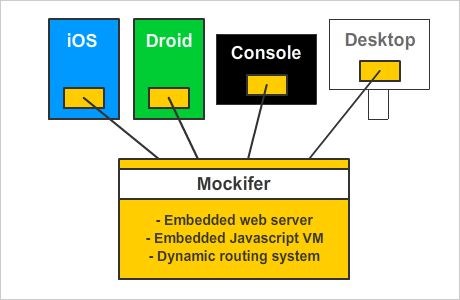
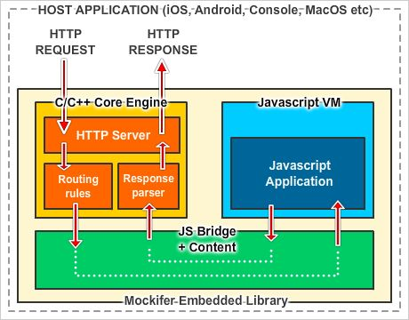
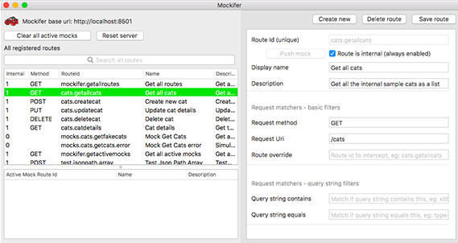
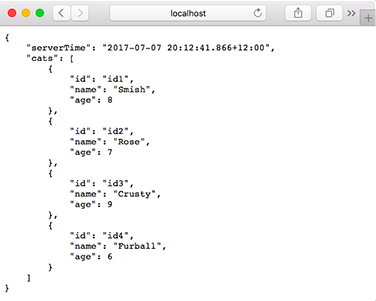
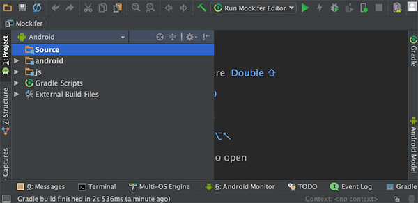
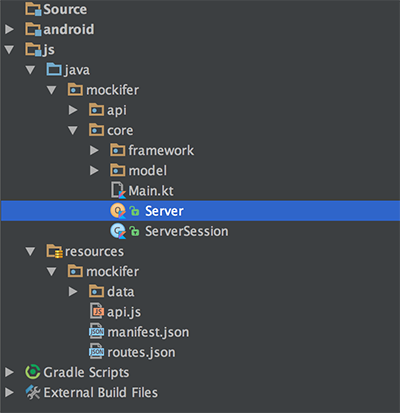
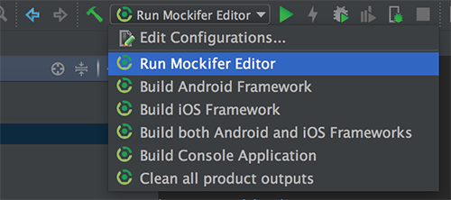
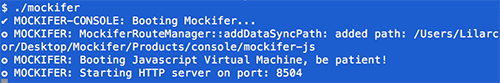
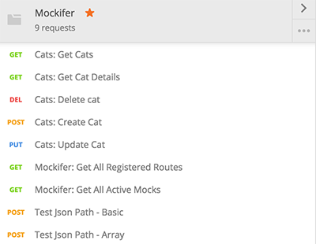

# Mockifer - a cross platform embeddable mocking server for iOS, Android and MacOs

--


- [Introduction](#introduction)
- [Getting started guide](#quick_start_guide)
- [Dynamic routing system](#routing_system)
- [Working with Mockifer](#working_with_mockifer)
- [Mockifer API](#mockifer_api)

<a name="introduction"></a>
--
# Introduction

**Mockifer** is a framework for building a portable http web server that can be embedded into mobile and other targets and used internally as a server endpoint - making it perfect for *demo* versions of an app or for automation tests with it taking the role of a *mock server*.



Some of the key goals for the creation of **Mockifer** were:

1. It must be able to be embedded directly inside iOS, Android or whatever other platforms desired.
2. When deployed, it must be self contained and require no external library dependencies to run.
3. It must be portable and be able to compile to target iOS, Android, MacOS (console and desktop) and potentially other target platforms.
4. It must be easy to setup and configure mock request responses.
5. It must be easy to setup and configure rich request responses.
6. It must be authored to be compatible with an *MIT licence* in its code and libraries that it uses so everyone can safely use and share it.

### Why bother? - there are already other embeddable server options!

There are many ways to create local web servers or mocking servers that run on the desktop or for specific platforms architectures, however there don't seem to be very many solutions that are truly embeddable and portable that can be **embedded** across **different platforms** produced from the **same code base**.

The goal of this framework is to produce a cross platform library - primarily for iOS and Android (though compatible with other targets also), that behaves like a development or mock server, but that can be **packaged internally and completely self contained** inside a host application - write **once** and compile to **many**.

### How does it work?

At a glance, Mockifer is comprised of:



**C/C++ Core Engine**

- The *C/C++ core engine* runs a portable web server alongside an embedded *Javascript virtual machine* and handles incoming HTTP requests using a routing system driven by dynamic rules.

- The *C/C++ core engine* is **decoupled** from the embedded *Javascript application* so they can have different software development lifecycles. The likely scenario is that the *C/C++ core engine* would rarely - if ever - change, whereas the embedded *Javascript application* and *routing configurations* would change regularly as more routes and responses are configured. Because they are separate components, they can be deployed separately from each other.

- By decoupling the *C/C++ core engine* from the *Javascript application* and *route configurations*, there is no need to write any code in C/C++ to use Mockifer (unless new functionality is needed inside the core engine). This was a deliberate decision - having a Javascript and content based server implementation makes Mockifer far more accessible to developers and / or automation testers than C/C++ is.

- The HTTP web server in the core engine is provided by the open source library [CivitWeb - https://github.com/civetweb/civetweb]("https://github.com/civetweb/civetweb").

- All JSON parsing in the core engine is performed by the open source library [JsonCpp - https://github.com/open-source-parsers/jsoncpp]("https://github.com/open-source-parsers/jsoncpp")

- The embedded Javascript Virtual Machine in the core engine is provided by the open source library [Duktape - https://github.com/svaarala/duktape]("https://github.com/svaarala/duktape")

**Routing rules - dynamic routing system**

- The core engine runs a **dynamic routing rule system** for all incoming requests which forms the heart of handling all requests.

- A collection of *registered routes* is evaluated for each request, and based on their rules, the *C/C++ core engine* will forward a selected route (if it matches one) to the embedded *Javascript application* to process and respond to.

- Registered routes can be configured to always be evaluated for each request, or only evaluated if they are **activated** first. This allows a flexible system where a set of routes is used as a constant foundation, but **mock** routes can be activated when needed to override responses.

**Javascript bridge and content**

- The bridge between the *C/C++ core engine* and the embedded *Javascript virtual machine* is made via a small set of methods that each side must contractually meet.
- Alongside the actual Javascript source files sits all other content such as the collection of **routes**, **mock responses** and other assets.

**Javascript Virtual Machine**

- The Javascript Virtual Machine (powered by *Duktape*) hosts the dynamic server application itself, which the core engine delegates requests to fetch the appropriate *response*.

- The Javascript application running in the virtual machine must take a *request* and *route* and return a *response* to the core engine, which is then forwarded back to the original caller as a HTTP response.

- The Javascript Virtual Machine is capable of running any *Ecmascript E5/E5.1* compliant Javascript code (as supported by *Duktape*).

- **Mockifer** uses [Kotlin JS - https://kotlinlang.org/docs/reference/js-overview.html]("https://kotlinlang.org/docs/reference/js-overview.html") to author the dynamic server application. By using *Kotlin JS*, the server Javascript development can be done using *Android Studio* and with all the benefits of an *IntelliJ* IDE and the awesome-sauce that is *Kotlin*.

- Although the **Mockifer** framework uses *Kotlin JS*, it is completely possible to use other Javascript code instead, but I **hate** writing Javascript so I chose to go with *Kotlin JS*!

<a name="quick_start_guide"></a>
--
# Getting started guide

Video tutorial: [https://www.youtube.com/watch?v=uK-jodGaHZ0](https://www.youtube.com/watch?v=uK-jodGaHZ0)

[](https://www.youtube.com/watch?v=uK-jodGaHZ0)

Mockifer was written with mobile applications in mind - therefore it requires a few key mobile development tools to be available in order to compile and edit.

By nature this pretty much means that you'll need to be working on a Mac. Mockifer could probably be adjusted to compile on Windows machines too but it's not something I'm interested in pursuing - feel free to fork this repo if you are so inclined!

### Step 1: Install prerequisite tools

- Xcode along with developer provisioning. Mockifer was originally created using Xcode 8.
- Xcode command line build tools which can be installed via:

```
xcode-select --install
```

- Android Studio and accompanying Android SDK. Mockifer was originally created using Android Studio 2.3.
- Android Studio Kotlin plugin. [https://kotlinlang.org/docs/tutorials/kotlin-android.html](https://kotlinlang.org/docs/tutorials/kotlin-android.html). At the time of writing, Android Studio 3 had not yet been released but once it is released, the Kotlin plugin will not need to be manually installed.
- Android NDK and CMake which can be installed via the Android SDK Manager via Android Studio: [https://developer.android.com/ndk/guides/index.html](https://developer.android.com/ndk/guides/index.html)

### Step 2: Explore the project structure

The Mockifer folder structure is broken into two main sections; **Products** and **Source**.

The **products** folders contain mostly generated outputs from compiling the projects in the **source** folders. You should almost never edit content in a **product** folder, as it will be regenerated next time a build task is run.

The **products** folders are however the place where you would take a compiled library or framework to integrate into your own applications.

```
Mockifer root directory
|
+ ─ Products
|   + ─ android:        Compiled Android framework (.aar + content)
|   + ─ console:        Compiled standalone terminal application
|   + ─ editor:         Compiled MacOS desktop app for editing Mockifer routes
|   + ─ ios:            Compiled iOS framework (Xcode framework + content)
|   + ─ js:             Compiled Javascript application and supporting content
|   + ─ sample-android: Reference project for Mockifer integration with an Android application
|   + ─ sample-ios:     Reference project for Mockifer integration with an iOS application
|
+ ─ Source 
    + ─ android:        Android framework source
    + ─ console:        Xcode project for the terminal application
    + ─ editor:         Xcode project for the MacOS desktop editor application
    + ─ engine:         C/C++ core engine source - shared by reference to all other targets
    + ─ ios:            Xcode project for the universal iOS Framework
    + ─ js:             Kotlin JS project source for the embedded Javascript application


```

### Step 3: Show all Mockifer Gradle tasks

The Mockifer project uses Gradle and a collection of shell scripts to orchestrate its build pipeline, though typically the **Mockifer Editor** MacOS application and the **Kotlin JS** project via **Android Studio** would be used to edit and build.

If all the required tools are installed and available, run the following command to show all the Mockifer related Gradle build tasks:

```
./gradlew tasks
```

Note that the first time running this may take some time as Gradle will fetch project dependencies if you don't already have them. If everything went ok, a list of Gradle tasks will be displayed.

Look for the group with the heading **Mockifer tasks** which displays the following tasks:

```
Mockifer tasks
--------------
mockiferBuildAndroid - Build the Android .AAR engine. The framework will be generated in the /Products/android folder.
mockiferBuildConsole - Build a console application that runs Mockifer via terminal. The application will be generated in the /Products/console folder.
mockiferBuildEditor - Build the editor app that can run Mockifer as a desktop application and perform maintenance tasks. The app will be generated in the /Products/editor folder.
mockiferBuildIOS - Build the iOS Framework with the embedded Javascript engine. The framework will be generated in the /Products/ios folder.
mockiferBuildJavascriptEngine - Build the mockifer-js component that generates the Kotlin Javascript application to be embedded. Typically used internally by other tasks.
mockiferCleanProducts - Clears all generated product outputs in the /Products/* folders.
mockiferRunEditor - Compile the Javascript project if needed, then launch the editor application.
mockiferBuildMobileFrameworks - Build both the iOS Framework and the Android Library along with the Mockifer engine.

```

### Step 4: Test drive the editor

To see Mockifer in action, lets start the desktop editor application. From the root project folder, enter the following Gradle command:

```
./gradlew mockiferRunEditor
```

or use the convenience shell script:

```
./run_editor.sh
```

If the build succeeded, you should see an application appear that looks a bit like this:



Explore the **registered routes** to see how the configuration system works.

The editor is actually running Mockifer itself, so you can open your local web browser and point it to one of the routes to see it working! [http://localhost:8501/cats](http://localhost:8501/cats)



### Step 5: Test drive the sample apps

Video tutorial: [https://www.youtube.com/watch?v=lC5Hu0fw51s](https://www.youtube.com/watch?v=lC5Hu0fw51s)

[](https://www.youtube.com/watch?v=lC5Hu0fw51s)

Quit out of the editor and run the following Gradle task to build both the *Android Library* and *iOS Frameworks*:

```
./gradlew mockiferBuildMobileFrameworks
```

You could also build each framework separately if you would like to:

```
./gradlew mockiferBuildAndroid
```

```
./gradlew mockiferBuildIOS
```

After the mobile frameworks have successfully been built, open the following iOS sample with Xcode:

```
Products/sample-ios/MockiferSample.xcodeproj
```

And the Android sample with Android Studio:

```
Products/sample-android
```
Both sample projects show how to integrate **Mockifer** including a sample suite of *automation tests* that illustrate how to go about using the mocking aspect of **Mockifer** (eg *pushing* mocks in a test setup phase).

> Note to readers who are seasoned developers - the sample apps are written in as basic a possible way to keep the focus on the Mockifer integration points - I am aware that some of the code is fugly!

After building the mobile frameworks you can also run the shell scripts to run the example automated tests:

**Android**

> Note: Before starting the shell script, be sure you have an Android emulator running.

```
./run_sample_ui_tests_android.sh
```

**iOS Simulator**

> Note: You may need to edit the shell script to specify which simulator to run the tests on.

```
./run_sample_ui_tests_ios_simulator.sh
```

**iOS Device**

> Note: You will *definately* need to edit the shell script to specify which physical device to run the tests on.

```
./run_sample_ui_tests_ios_device.sh
```

<a name="routing_system"></a>
--
# Dynamic routing system

Video tutorial: [https://www.youtube.com/watch?v=jNC88N8UhyY](https://www.youtube.com/watch?v=jNC88N8UhyY)

[](https://www.youtube.com/watch?v=jNC88N8UhyY)

The heart of **Mockifer** is the *dynamic routing system*, which uses a small set of rules to figure out which *route* should be selected when a request is received.

Routes fall into roughly two categories:

1. **Internal routes** - these routes are always *on* and will always be evaluated for each incoming request.
2. **Mock routes** - these routes are always *off* and will **only** be evaluated for each incoming request if they are first **pushed**.

The idea is that the *internal* routes are what form the *foundation* of the server implementation and require no setup to be activated, whereas the *mock* routes must be activated to simulate conditions or scenarios - usually for automation testing where a repeatable state must be in place for each test run.

Here is a table of the route fields that can be edited using the editor application:

| Field        | Sample           | Description |
| ------------- |-------------| -----|
| Route Id      | cats.getallcats | An identifier that is **unique across all routes** known to Mockifer. |
| Internal Flag      | On / Off | If set to *on*, the route will form part of the foundation set of routes. If set to *off*, the route will only be evaluated if it is first *pushed*. |
| Display Name | Get all cats | A simple short display name for the route. |
| Description | Get all the cats in the known universe! | A longer description that gives an overview of the purpose and intent of the route |
| Request Method | GET | The HTTP request method that a request must have to be considered a match for the route. |
| Request Uri | /cats | A regular expression that will be applied to determine if the Uri of a request should be considered a match. For example a sample Uri of */cats/([^/]+)* would match */cats/id1* but would not match */cats*. |
| Route Override | some.other.route.id | The *route override* field is special in that it will simply *hijack* another route if the other route is found to be a match for the request. For example, if there was a route with Id *cats.getallcats* that matched a request, by creating a secondary route with *route override* set to *cats.getallcats*, it would cause the secondary route to run instead. This can be particularly useful for allowing *mock routes* to intercept and override default routes.|
| Query String Contains | bob | If this filter is specified, the raw query string of a request will be checked to see if it **contains** the given token. For example, if the token was *bob* then a request with the query string *cat-name=bobcat&age=10* would match.|
| Query String Equals | cat-name=bobcat | If this filter is specified, the raw query string of a request will be checked to see if it **equals** the given token. For example, if the token was *cat-name=bobcat* then a request with the query string *cat-name=bobcat* would match, but a query string of *cat-name=bobcat&age=10* would not.|
| Request Body JSON Path | /person/name<br>/people/1/name | By specifying a *JSON Path*, the route will attempt to **crawl** the request body if it is a valid JSON object to reach the node given in the path.<br><br>The value of the node if it is found is compared against the *JSON Path Contains* and *JSON Path Equals*.<br><br>To **crawl** the JSON path, it is first split into tokens, delimited by the / character. While *crawling* along the list of tokens, if an integer is encountered it will be interpreted as an index into a JSON array at the current node. The goal of the crawler is to reach the JSON node representing the final token in the path successfully. The value of the element in that node can then be evaluated to complete the filter.|
| JSON Path Contains | bob | When coupled with the *JSON Path* filter, the value that is found by *crawling* the path successfully will be a match if it **contains** the token. For example, if the value in the JSON path */cat/name* was *bobcat* and the token was *bob* then the filter would match.|
| JSON Path Equals | bobcat | When coupled with the *JSON Path* filter, the value that is found by *crawling* the path successfully will be a match if it **equals** the token. For example, if the value in the JSON path */cat/name* was *bobcat* and the token was *bobcat* then filter would match, but if the token was *bob* the filter would not match.|
| Http Status Code | 200 | If defined, the route will return the given status code if an internal implementation doesn't override it. This field is particularly useful to simulate server errors (eg. return a 500 error) that are usually difficult if not impossible to simulate in a real server.|
| Response Delay (ms) | 500 | If defined, the route will simulate a response delay with the given period of time. By default, routes do not simulate any delay and respond as fast as they are able. There is also a global response delay setting - see the API notes for more info.|
| Controller Id | cats.getallcats | If defined, the route will invoke the Javascript application to handle the request, using the *controller id* as a key for mapping to an internal request controller. The embedded Javascript application is responsible for mapping a controller internally with the given controller id.|
| Respond With JSON | { "name": "bob" } | If defined, forms a static *canned* response that will be delivered if the route is matched. Note that the response is saved into a JSON file with the same name as the route id in the */data/mocks* folder.|

### 'Pushing' mocks

One of the key features of Mockifer is the ability to create a set of dynamic routes that only become active if they are **pushed**. 

This allows mock routes or sequences of mock routes to be **pushed** into a queue that will be evaluated as requests come in.

As each *pushed/activated* mock route is matched to an incoming request, it is **consumed** and removed.

<a name="working_with_mockifer"></a>
--
# Working with Mockifer

Video tutorial: [https://www.youtube.com/watch?v=uik2h3ANGo0](https://www.youtube.com/watch?v=uik2h3ANGo0)

[](https://www.youtube.com/watch?v=uik2h3ANGo0)

### The editor

The MacOS editor is the preferred way to manage Mockifer routes and their configurations. When using the editor, all changes are automatically *synced* into the following folders:

```
Products/js/mockifer-js
```

```
Source/js/src/main/resources/mockifer
```

This means that after editing route definitions via the editor, any build job that is run afterward should already have up to date content data files.

The editor can be launched directly from Android Studio (instead of using a command line Gradle task) which is the preferred way to test the Javascript application code.

### Opening the Javascript application for editing

Follow these steps to be able to edit the Javascript application code (written in *Kotlin JS*):

1. Open *Android Studio*
2. Choose *Import project (Eclipse ADT, Gradle, etc.)*
3. Navigate to the root *Mockifer* folder in the files dialog.
4. Press *OK*

After the project opens and performs a Gradle sync, you should see a screen similar to this:



> Note: Android Studio has a nasty habit of completely deleting the contents of the hidden **.idea** folder when a new project is *imported*. This means any saved *run configurations* get deleted. After importing the Mockifer project for the first time, execute the following command from Terminal to restore the run configurations:<br><br> ```./install_run_configurations.sh``` <br><br>After installing the run configurations, a drop down list of run profiles will appear in Android Studio. This should only need to be done *once* after a fresh import of the Mockifer project.


The project view includes the *Android Library* module and the *Javascript (Kotlin)* module.

The *Android Library* module can be edited to change the resulting **.aar** artifact, but this library module would rarely need to be changed.

The *Javascript application* has the following structure:



The *java/mockifer* folder contains all the *Kotlin JS* code that runs inside the Javascript virtual machine and is responsible for responding to requests.

The *resources/mockifer* folder contains the configuration content that drives the routing system and integration with the *core engine*. In particular:

```
resources/mockifer
|
+ ─ data
|   + ─ internal:     any files or content that isn't dynamically generated and is typically privately referenced by Kotlin code
|   + ─ mocks:        auto generated mock response files - use the editor to maintain these
|
+ ─ api.js:           Javascript file that forms the bridging contract to the core engine - do not change this
+ ─ manifest.json:    manifest of which Javascript source files should bootstrap when starting Mockifer
+ ─ routes.json:      auto generated collection of registered routes - use the editor to maintain these

```

### Run profiles

The **Mockifer** Gradle project has some useful preconfigured run profiles. Access them while in Android studio:



When editing the *Kotlin JS* code you would normally trigger the **Run Mockifer Editor**  profile to build the Kotlin Javascript application and boot it up with the editor application.

### Console application

Mockifer can also run as a standalone console application via terminal as well. Build the console application with the *Build Console Application* run profile in Android Studio, or by running the following Gradle task:

```
./gradlew mockiferBuildConsole
```

Then start it:

```
cd Products/console
./mockifer
```



### Postman

Once the console application is running, Mockifer can be reached through a web browser, or any other means of making HTTP requests.

A great tool for interacting with HTTP APIs is [Postman](https://www.getpostman.com/) which can be installed as a Chrome app.

If you have *Postman* installed, import the file ```Support/Mockifer.postman_collection.json``` to try out all the Mockifer sample routes.

> Note that the Mockifer Postman samples point at port **8501** by default, which is what the *Mockifer Editor* runs on. Tweak the port number to **8504** in *Postman* if you want to connect to the console application.



<a name="mockifer_api"></a>
--
# Mockifer API

Both iOS and Android share the same basic set of APIs, with some small language adjustments between the platforms.

### Android

> Note: Mockifer itself will automatically start and stop once it is *installed* into an Android app, based on the application lifecycle callbacks and how many activities exist. If there are no known activities running within the application, Mockifer will shut itself down after a period of time.

| Method        | Description |
| ------------- |-----|
| ```Mockifer.install(application)``` | Call this within your *onCreate* method of your *Application* class to initialize Mockifer with default configuration. |
| ```Mockifer.install(application, port)``` | Call this within your *onCreate* method of your *Application* class along with a port number to listen on. |
| ```Mockifer.reset()``` | Call this method at any time to revert all internal state, including removal of any pending *active mock routes*. Typically used between automation tests to begin at the default state again.|
| ```Mockifer.setGlobalResponseDelay(millis)```| Call this to configure the *global* response delay in milliseconds applied to simulate response lag. Calling ```Mockifer.reset()``` will clear this setting.|
| ```Mockifer.clearActiveMocks()``` | Call this to remove any pending *active mock routes* that might still be queued to be evaluated for incoming requests.|
| ```Mockifer.pushMock(routeid)``` | Enqueue the route with the given route id **once** to the list of *active* mock routes to evaluate.|
| ```Mockifer.pushMock(routeid, times)```| Same as ```pushMock``` but the route will be added ```times``` number of times into the active mocks list.|
| ```Mockifer.pushMock(... routeids)```| Enqueue a list of route ids, **once** each, into the active mocks list.|


### iOS

> Note: Unlike for Android, Mockifer in iOS is *manually* started and stopped, typically in the application delegate class.

For brevity, only the *Swift* methods are shown below, but the Mockifer framework is actually authored in *ObjectiveC++* so all these methods are available directly from *ObjectiveC* as well.

| Method        | Description |
| ------------- |-----|
|```Mockifer.start()```|Starts the Mockifer server if it is not already started. Typically called in the application delegate *init*.|
|```Mockifer.start(port)```| Starts the Mockifer server on the given port if it is not already started.|
|```Mockifer.stop()```| Stops the Mockifer server if it is running. Typically called in the application delegate *deinit*.|
| ```Mockifer.reset()``` | Call this method at any time to revert all internal state, including removal of any pending *active mock routes*. Typically used between automation tests to begin at the default state again.|
|```Mockifer.setGlobalResponseDelay(millis)```|Call this to configure the *global* response delay in milliseconds applied to simulate response lag. Calling ```Mockifer.reset()``` will clear this setting.|
| ```Mockifer.clearActiveMocks()``` | Call this to remove any pending *active mock routes* that might still be queued to be evaluated for incoming requests.|
| ```Mockifer.pushMock(routeid)``` | Enqueue the route with the given route id **once** to the list of *active* mock routes to evaluate.|
| ```Mockifer.pushMock(routeid, times)```| Same as ```pushMock``` but the route will be added ```times``` number of times into the active mocks list.|
| ```Mockifer.pushMock([routeid])```| Enqueue an array of route ids, **once** each, into the active mocks list.|


# Licence

- - - - - - - - - - - - - - - - - - - - - - - - - - - - - - - - - - - - - -

***Start: Mockifer License***

 MIT License

Copyright (c) 2017 Marcel Braghetto

Permission is hereby granted, free of charge, to any person obtaining a copy
of this software and associated documentation files (the "Software"), to deal
in the Software without restriction, including without limitation the rights
to use, copy, modify, merge, publish, distribute, sublicense, and/or sell
copies of the Software, and to permit persons to whom the Software is
furnished to do so, subject to the following conditions:

The above copyright notice and this permission notice shall be included in all
copies or substantial portions of the Software.

THE SOFTWARE IS PROVIDED "AS IS", WITHOUT WARRANTY OF ANY KIND, EXPRESS OR
IMPLIED, INCLUDING BUT NOT LIMITED TO THE WARRANTIES OF MERCHANTABILITY,
FITNESS FOR A PARTICULAR PURPOSE AND NONINFRINGEMENT. IN NO EVENT SHALL THE
AUTHORS OR COPYRIGHT HOLDERS BE LIABLE FOR ANY CLAIM, DAMAGES OR OTHER
LIABILITY, WHETHER IN AN ACTION OF CONTRACT, TORT OR OTHERWISE, ARISING FROM,
OUT OF OR IN CONNECTION WITH THE SOFTWARE OR THE USE OR OTHER DEALINGS IN THE
SOFTWARE.

***End: Mockifer License***

- - - - - - - - - - - - - - - - - - - - - - - - - - - - - - - - - - - - - -

***Start: Civetweb License***

Copyright (c) 2013-2017 The CivetWeb developers ([CREDITS.md](https://github.com/civetweb/civetweb/blob/master/CREDITS.md))

Copyright (c) 2004-2013 Sergey Lyubka

Copyright (c) 2013 No Face Press, LLC (Thomas Davis)

Copyright (c) 2013 F-Secure Corporation

Permission is hereby granted, free of charge, to any person obtaining a copy
of this software and associated documentation files (the "Software"), to deal
in the Software without restriction, including without limitation the rights
to use, copy, modify, merge, publish, distribute, sublicense, and/or sell
copies of the Software, and to permit persons to whom the Software is
furnished to do so, subject to the following conditions:

The above copyright notice and this permission notice shall be included in
all copies or substantial portions of the Software.

THE SOFTWARE IS PROVIDED "AS IS", WITHOUT WARRANTY OF ANY KIND, EXPRESS OR
IMPLIED, INCLUDING BUT NOT LIMITED TO THE WARRANTIES OF MERCHANTABILITY,
FITNESS FOR A PARTICULAR PURPOSE AND NONINFRINGEMENT. IN NO EVENT SHALL THE
AUTHORS OR COPYRIGHT HOLDERS BE LIABLE FOR ANY CLAIM, DAMAGES OR OTHER
LIABILITY, WHETHER IN AN ACTION OF CONTRACT, TORT OR OTHERWISE, ARISING FROM,
OUT OF OR IN CONNECTION WITH THE SOFTWARE OR THE USE OR OTHER DEALINGS IN
THE SOFTWARE.

***End: Civetweb License***

- - - - - - - - - - - - - - - - - - - - - - - - - - - - - - - - - - - - - -

***Start: Duktape license***

(http://opensource.org/licenses/MIT)

Copyright (c) 2013-2017 by Duktape authors (see AUTHORS.rst)

Permission is hereby granted, free of charge, to any person obtaining a copy
of this software and associated documentation files (the "Software"), to deal
in the Software without restriction, including without limitation the rights
to use, copy, modify, merge, publish, distribute, sublicense, and/or sell
copies of the Software, and to permit persons to whom the Software is
furnished to do so, subject to the following conditions:

The above copyright notice and this permission notice shall be included in
all copies or substantial portions of the Software.

THE SOFTWARE IS PROVIDED "AS IS", WITHOUT WARRANTY OF ANY KIND, EXPRESS OR
IMPLIED, INCLUDING BUT NOT LIMITED TO THE WARRANTIES OF MERCHANTABILITY,
FITNESS FOR A PARTICULAR PURPOSE AND NONINFRINGEMENT. IN NO EVENT SHALL THE
AUTHORS OR COPYRIGHT HOLDERS BE LIABLE FOR ANY CLAIM, DAMAGES OR OTHER
LIABILITY, WHETHER IN AN ACTION OF CONTRACT, TORT OR OTHERWISE, ARISING FROM,
OUT OF OR IN CONNECTION WITH THE SOFTWARE OR THE USE OR OTHER DEALINGS IN
THE SOFTWARE.

***End: Duktape license***

- - - - - - - - - - - - - - - - - - - - - - - - - - - - - - - - - - - - - -

***Start: JSONCPP license***

The JsonCpp library's source code, including accompanying documentation, 
tests and demonstration applications, are licensed under the following
conditions...

The JsonCpp Authors explicitly disclaim copyright in all 
jurisdictions which recognize such a disclaimer. In such jurisdictions, 
this software is released into the Public Domain.

In jurisdictions which do not recognize Public Domain property (e.g. Germany as of
2010), this software is Copyright (c) 2007-2010 by The JsonCpp Authors, and is
released under the terms of the MIT License (see below).

In jurisdictions which recognize Public Domain property, the user of this 
software may choose to accept it either as 1) Public Domain, 2) under the 
conditions of the MIT License (see below), or 3) under the terms of dual 
Public Domain/MIT License conditions described here, as they choose.

The MIT License is about as close to Public Domain as a license can get, and is
described in clear, concise terms at:

   http://en.wikipedia.org/wiki/MIT_License
   
The full text of the MIT License follows:

- - - - - - - - - - - - - - - - - - - - - - - - - - - - - - - - - - - - - -
Copyright (c) 2007-2010 The JsonCpp Authors

Permission is hereby granted, free of charge, to any person
obtaining a copy of this software and associated documentation
files (the "Software"), to deal in the Software without
restriction, including without limitation the rights to use, copy,
modify, merge, publish, distribute, sublicense, and/or sell copies
of the Software, and to permit persons to whom the Software is
furnished to do so, subject to the following conditions:

The above copyright notice and this permission notice shall be
included in all copies or substantial portions of the Software.

THE SOFTWARE IS PROVIDED "AS IS", WITHOUT WARRANTY OF ANY KIND,
EXPRESS OR IMPLIED, INCLUDING BUT NOT LIMITED TO THE WARRANTIES OF
MERCHANTABILITY, FITNESS FOR A PARTICULAR PURPOSE AND
NONINFRINGEMENT. IN NO EVENT SHALL THE AUTHORS OR COPYRIGHT HOLDERS
BE LIABLE FOR ANY CLAIM, DAMAGES OR OTHER LIABILITY, WHETHER IN AN
ACTION OF CONTRACT, TORT OR OTHERWISE, ARISING FROM, OUT OF OR IN
CONNECTION WITH THE SOFTWARE OR THE USE OR OTHER DEALINGS IN THE
SOFTWARE.

(END LICENSE TEXT)

The MIT license is compatible with both the GPL and commercial
software, affording one all of the rights of Public Domain with the
minor nuisance of being required to keep the above copyright notice
and license text in the source code. Note also that by accepting the
Public Domain "license" you can re-license your copy using whatever
license you like.


***End: JSONCPP license***

- - - - - - - - - - - - - - - - - - - - - - - - - - - - - - - - - - - - - -
